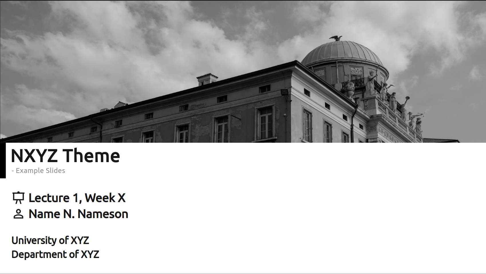
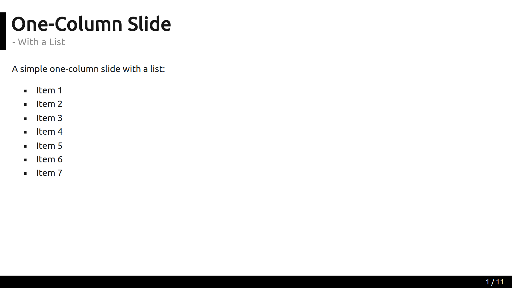
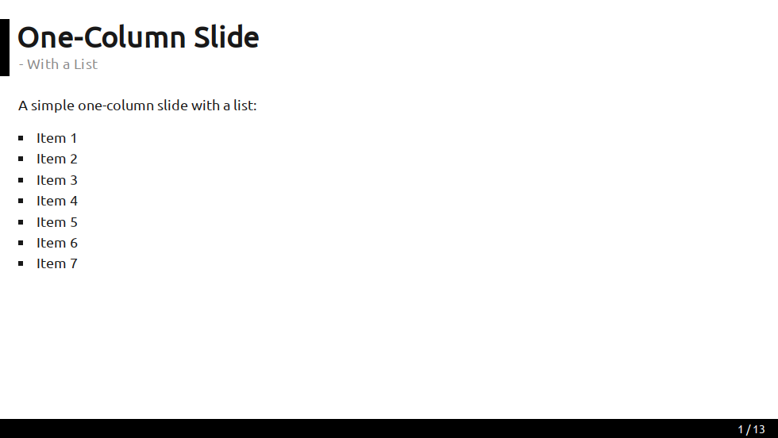
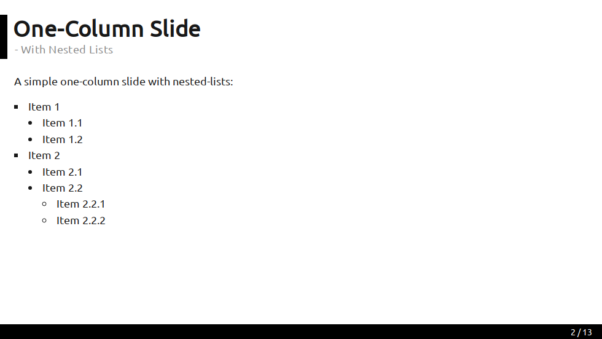
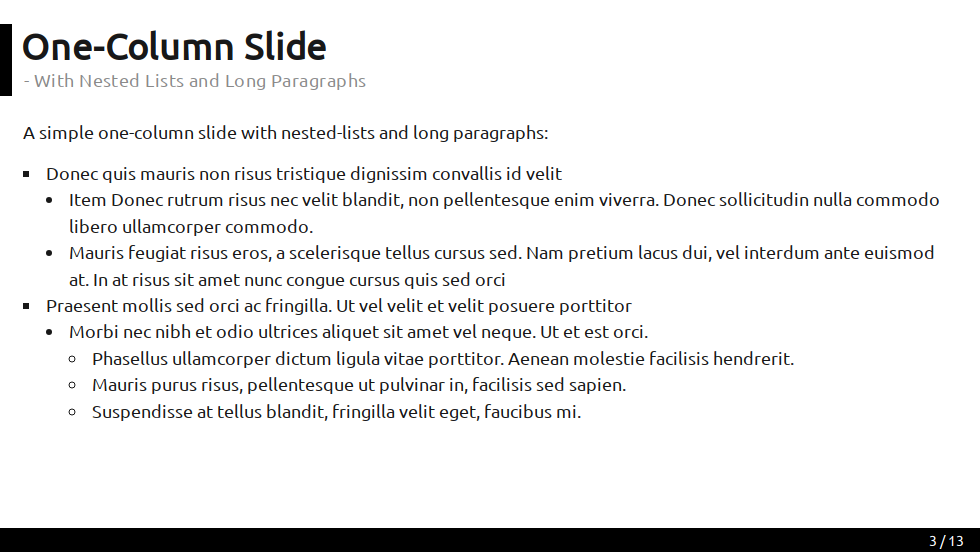
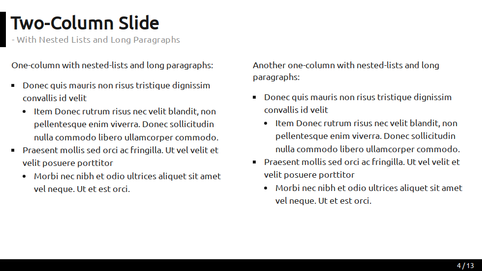
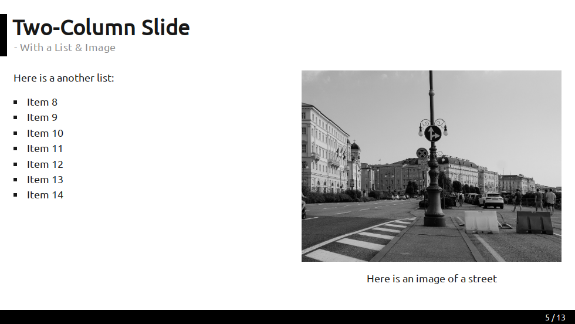
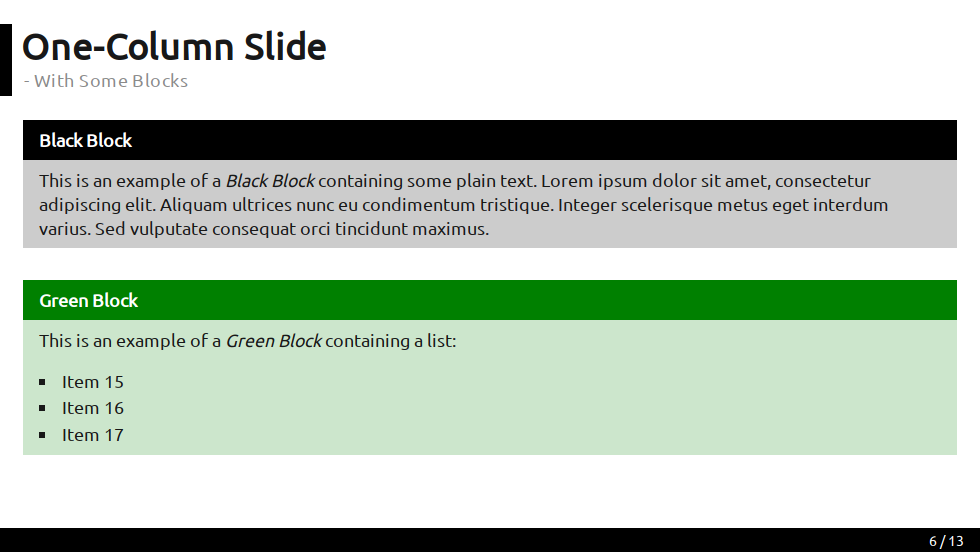
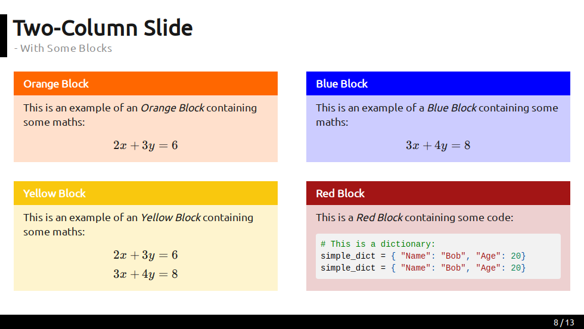

# Slidev Theme - NXYZ

[](https://www.npmjs.com/package/slidev-theme-nxyz)

A minimalistic [sli.dev](https://sli.dev) theme.

## Layouts

The theme currently has a limited set of layouts:

- `cover`
- `default`

### Cover Layout

The cover layout is supposed to be used on the very first slide. Using the following settings: 

```text
---
theme: "nxyz"
layout: "cover"
colorSchema: "light"
fonts:
  sans: "Ubuntu"
  serif: "Kreon"
  mono: "Ubunto Monospace"
aspectRatio: "16/9"
highlighter: "prism"
presenter: true
slideTitle: "NXYZ Theme"
slideSubtitle: "Example Slides"
presentationID: "Lecture 1, Week X"
author: "Name N. Nameson"
university: "University of XYZ"
department: "Department of XYZ"
coverImagePath: "./node_modules/slidev-theme-nxyz/img/building.png"
barBottomText: ""
---
```
The settings produce the following cover slide:




### Default Layout

The deafult layout is supposed to be used on all slides following the cover slide. For example, using the following settings and text for a slide:
```text
---
layout: "default"
slideTitle: "One-Column Slide"  
slideSubtitle: "With a List"
---

A simple one-column slide with a list:

- Item 1
- Item 2
- Item 3
- Item 4
- Item 5
- Item 6
- Item 7
```

Then we get the following:



### Additional Examples

Some additional examples based on the  `main.md` file in this repo can be seen in the following:











